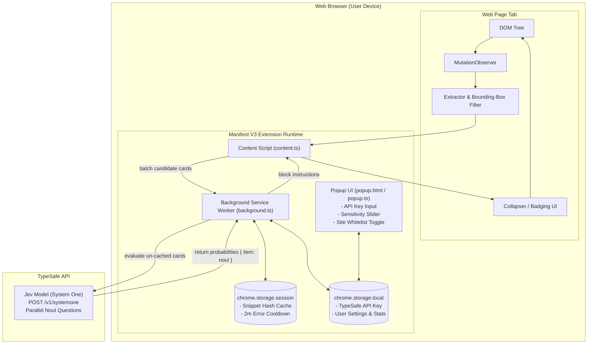

# 🛡️ Jev Shield

> **Privacy-first, open-source Google Chrome extension that semantically blocks native ads, sponsored feed posts, and stealth promotions using TypeSafe's Jev model.**

[](LICENSE)
[](#)
[](https://typesafe.ai)

Traditional ad blockers (like uBlock Origin) rely on static URL blocklists and CSS selector filters. While effective for banner networks, they struggle with **native ads and sponsored feed cards** (on platforms like X/Twitter, Reddit, LinkedIn, and modern digital publications) where promotional posts share the exact same first-party domain, layout, and styling as organic content.

**Jev Shield** solves this by applying **System One AI intelligence** directly in your browser. Using TypeSafe's **Jev** model and its **`noul`** primitive, Jev Shield evaluates candidate feed elements semantically and computes the calibrated probability that an element is an ad, collapsing confirmed promotions before they clutter your feed.

---

## ✨ Features

- 🧠 **Semantic Ad Detection**: Understands context, nuance, and promotional phrasing rather than relying only on rigid class names or URL lists.
- ⚡ **Bounding-Box Pre-Filtering**: Automatically filters out invisible tracking pixels (`rect.height <= 40 || rect.width <= 40`), hidden analytics wrappers, icon badges, and zero-dimension script containers before touching the heuristic or AI layers.
- 📦 **Batch Request Fan-Out**: Evaluates multiple candidate feed elements in parallel in a single TypeSafe API call, reducing latency, token consumption, and cost.
- 💾 **Session Caching (`chrome.storage.session`)**: Caches evaluated snippet hashes in browser memory. Caches persist across Manifest V3 service worker idle shutdowns without causing wear on disk I/O.
- ⏱️ **Automatic Error Back-Off**: Catches HTTP 401 (invalid key) or 429 (rate limited) responses and triggers a temporary 2-minute cooldown in session storage to protect the browser and prevent rapid failure loops.
- 👁️ **Soft-Collapse Badging**: Replaces blocked sponsored items with a minimal, non-intrusive badge showing Jev's confidence score and allowing users to inspect or reveal the original element at any time.
- 🔒 **BYOK (Bring Your Own Key) Security**: Zero telemetry. Your API key is stored strictly on your machine in `chrome.storage.local` and is never sent anywhere except directly to `https://api.typesafe.ai`.

---

## 🏗️ Architecture



---

## 🚀 Getting Started

### Prerequisites
- [Node.js](https://nodejs.org/) v20.0 or higher
- [Google Chrome](https://www.google.com/chrome/) or any Chromium-based browser (Brave, Edge, Arc, Opera)
- A [TypeSafe AI API Key](https://typesafe.ai)

### 1. Installation & Build

```bash
# Clone the repository
git clone https://github.com/your-username/jev-shield.git
cd jev-shield

# Install dependencies
npm install

# Build the extension for production
npm run build
```

The compiled extension bundle will be output into the `dist/` folder.

### 2. Loading into Google Chrome

1. Open Chrome and navigate to `chrome://extensions/`.
2. Enable **Developer mode** using the toggle in the top-right corner.
3. Click the **Load unpacked** button.
4. Select the **`dist`** directory inside your `jev-shield` project folder.
5. The **Jev Shield** icon (`🛡️`) will now appear in your Chrome toolbar!

### 3. Setup Your API Key

1. Click the **Jev Shield** icon in the Chrome toolbar to open the popup.
2. Paste your TypeSafe API key (`sk_live_...`) into the API Key input field and click **Save**.
3. Customize your **AI Sensitivity** threshold (default is **85%**).
4. Browse your favorite feeds (e.g. Reddit, X/Twitter, or news sites). Sponsored cards and native promotional posts will be semantically blocked and badged!

---

## 🛠️ Project Structure

```text
jev-shield/
├── manifest.json            # Chrome Manifest V3 configuration
├── vite.config.ts           # Vite + CRXJS plugin bundler config
├── tsconfig.json            # TypeScript configuration
├── package.json             # Dependencies and scripts
├── public/icons/            # Extension icons (16x16, 48x48, 128x128)
├── src/
│   ├── types/
│   │   └── index.ts         # Shared TypeScript interfaces & messaging types
│   ├── content/
│   │   ├── extractor.ts     # Bounding-box pre-filtering, heuristic selection & hashing
│   │   └── index.ts         # Content script: MutationObserver & DOM manipulation
│   ├── background/
│   │   ├── typesafe.ts      # TypeSafe API client, Jev parallel questions, error back-off
│   │   └── index.ts         # Service worker: chrome.storage.session caching & messaging
│   └── popup/
│       ├── index.html       # Extension popup markup
│       ├── popup.css        # Clean, accessible styling
│       └── popup.ts         # Popup state management & settings UI
```

---

## ⚖️ Legal & Privacy

- **User Sovereignty:** Modifying how web pages render on your local device is legally protected under established precedent worldwide (including the landmark German Federal Supreme Court rulings in *Axel Springer v. AdBlock Plus*).
- **Privacy First:** Jev Shield only transmits candidate text snippets to the TypeSafe evaluation API to determine whether they are ads. It transmits zero cookies, session headers, credentials, or personal browsing history.
- **Open Source:** Licensed under the [MIT License](LICENSE). Contributions, bug reports, and pull requests are welcome!
