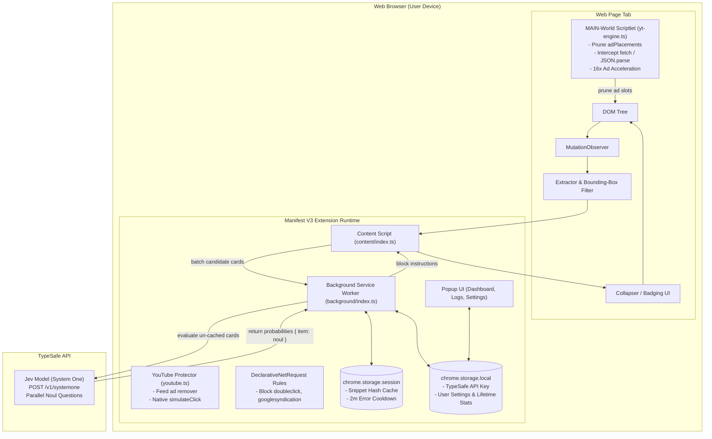

# 🛡️ Jev Shield

> **Privacy-first, open-source Google Chrome extension (Manifest V3) that semantically blocks native ads, sponsored feed posts, and stealth promotions using TypeSafe's Jev model, backed by a dual-layer media protection engine.**

[](LICENSE)
[](#)
[](https://typesafe.ai)

Traditional ad blockers (like uBlock Origin) rely primarily on static URL filterlists and CSS selector lists. While effective for traditional banner networks, they struggle with **native ads and sponsored feed cards** (on platforms like X/Twitter, Reddit, LinkedIn, and modern digital feeds) where promotional posts share the exact same first-party domain, markup structure, and styling as organic content.

**Jev Shield** solves this by applying **System One AI intelligence** directly in your browser. Using TypeSafe's **Jev** model and its **`noul`** primitive, Jev Shield semantically evaluates candidate elements and calculates the calibrated probability that an element is promotional, collapsing confirmed native ads before they clutter your reading experience.

In addition, Jev Shield includes a **dedicated YouTube engine** engineered to defeat modern server-side ad insertion and in-stream video ads without triggering Google's anti-adblock black-screen penalties.

---

## ✨ Features

- 🧠 **Semantic Ad Detection**: Evaluates context, phrasing, and promotional intent rather than relying solely on fragile class names or URL lists.
- 🚫 **Traditional Display & Network Blocker**:
  - **DeclarativeNetRequest Rules**: Blocks 20 major third-party ad, pop-under, and tracking networks (`doubleclick`, `googlesyndication`, `antiadblocksystems`, `popads`, `taboola`, `criteo`, etc.) at the network layer without browser penalties.
  - **Display Banner & Iframe Remover**: Automatically discovers and collapses traditional banner containers (`.code-block`, `ins.adsbygoogle`, `iframe[id*="__clb-"]`, `#carbonads`, etc.) with `display: none !important`.
- 📺 **Dual-Layer YouTube Engine**:
  - **MAIN-World Scriptlet (`src/content/yt-engine.ts`)**: Injected at `document_start` into the page's execution context to strip `adPlacements`, `playerAds`, and `adSlots` from player responses before YouTube's video player initializes.
  - **In-Stream Rapid Skipping (`src/content/youtube.ts`)**: Accelerates in-stream ads to 16x muted (playing a 15-second ad in ~0.9 seconds with natural frame decoding), avoiding the 10–15s black screen buffer stalls caused by unnatural duration seeks.
  - **Pointer & Mouse Simulation (`simulateClick`)**: Simulates the full gesture lifecycle (`pointerdown` ➔ `mousedown` ➔ `pointerup` ➔ `mouseup` ➔ `click`) to bypass modern Polymer event restrictions on skip buttons in any language ("Skip", "Ignorar", "Pular").
- ⚡ **Bounding-Box Pre-Filtering**: Automatically filters out invisible tracking pixels (`rect.height <= 40 || rect.width <= 40`), hidden analytics wrappers, icon badges, and zero-dimension script containers before touching the heuristic or AI layers.
- 📦 **Batch Request Fan-Out**: Evaluates multiple candidate feed elements in parallel in a single TypeSafe API call, optimizing token consumption and reducing latency.
- 💾 **Session Caching (`chrome.storage.session`)**: Caches evaluated snippet hashes in browser memory. Caches persist across Manifest V3 service worker idle shutdowns without causing wear on disk I/O.
- ⏱️ **Automatic Error Back-Off**: Catches HTTP 401 (invalid key) or 429 (rate limited) responses and triggers a temporary 2-minute cooldown in session storage to protect the browser and prevent rapid failure loops.
- 📊 **3-Tab Analytics Popup UI**:
  - **Dashboard**: Per-page block counter, 4-metric overview (Total Blocked, Total Scanned, Cache Efficiency %, Jev API Calls), sensitivity threshold slider, and site whitelist toggle.
  - **Activity Log**: Real-time chronological feed of blocked elements with confidence scores and text snippets.
  - **Settings**: BYOK API key configuration, memory cache flush, and statistics reset.
- 🔒 **BYOK (Bring Your Own Key) Security**: Zero telemetry. Your API key is stored strictly on your machine in `chrome.storage.local` and is never sent anywhere except directly to `https://api.typesafe.ai`.

---

## 🏗️ Architecture



---

## 🚀 Getting Started

### Prerequisites
- [Node.js](https://nodejs.org/) v20.0 or higher
- [Google Chrome](https://www.google.com/chrome/) or any Chromium-based browser (Brave, Edge, Arc, Opera)
- A [TypeSafe AI API Key](https://typesafe.ai)

### 1. Installation & Build

```bash
# Clone the repository
git clone https://github.com/your-username/jev-shield.git
cd jev-shield

# Install dependencies
npm install

# Build the extension for production
npm run build
```

The compiled extension bundle will be output into the `dist/` directory.

### 2. Loading into Google Chrome

1. Open Chrome and navigate to:
   ```text
   chrome://extensions/
   ```
2. Enable **Developer mode** using the toggle in the top-right corner.
3. Click the **Load unpacked** button in the top-left corner.
4. Select the **`dist`** directory inside your `jev-shield` project folder.
5. Click the **Puzzle icon (🧩)** in the Chrome toolbar and pin **Jev Shield (🛡️)** to your toolbar.

### 3. Launching in an Isolated Test Profile (Optional)

You can launch a dedicated Chrome test window with Jev Shield pre-loaded:

```bash
npm run test:chrome
```

Or target a specific URL directly:
```bash
node scripts/launch_chrome.js "https://www.youtube.com/watch?v=9EkMD8BoRVw"
```

### 4. Setup Your API Key

1. Click the **Jev Shield** icon in the Chrome toolbar.
2. Select the **Settings** tab.
3. Paste your TypeSafe API key (`sk_live_...`) into the API Key input field and click **Save**.
4. Adjust your **AI Sensitivity** threshold in the Dashboard (default is **85%**).
5. Browse feeds (e.g. Reddit, X/Twitter, or news feeds) or stream videos on YouTube without intrusive ads or black-screen buffering stalls.

---

## 🛠️ Project Structure

```text
jev-shield/
├── manifest.json            # Chrome Manifest V3 configuration (MV3)
├── vite.config.ts           # Vite + CRXJS plugin bundler config
├── tsconfig.json            # Strict TypeScript configuration
├── package.json             # Dependencies, build, and test scripts
├── rules/
│   └── ad_rules.json        # DeclarativeNetRequest network blocking rules
├── scripts/
│   └── launch_chrome.js     # Dedicated Chrome instance launcher for testing
├── public/icons/            # Extension icons (16x16, 48x48, 128x128)
├── src/
│   ├── types/
│   │   └── index.ts         # Shared TypeScript interfaces & messaging contracts
│   ├── content/
│   │   ├── extractor.ts     # Bounding-box pre-filtering, heuristics, FNV-1a hashing
│   │   ├── youtube.ts       # Isolated content script: feed cleaner & gesture clicker
│   │   ├── yt-engine.ts     # MAIN-world scriptlet: player ad pruning & 16x acceleration
│   │   └── index.ts         # Primary content script: MutationObserver & badging
│   ├── background/
│   │   ├── typesafe.ts      # TypeSafe API client, parallel noul calls, error back-off
│   │   └── index.ts         # Service worker: session caching, metrics, domain block map
│   └── popup/
│       ├── index.html       # 3-tab popup markup (Dashboard, Logs, Settings)
│       ├── popup.css        # Clean, modern dark/light UI styling
│       └── popup.ts         # Popup state management, tab switching & settings UI
```

---

## ⚖️ Legal & Privacy

- **User Sovereignty:** Modifying how web pages render on your local device is legally protected under established precedent worldwide (including the landmark German Federal Supreme Court rulings in *Axel Springer v. AdBlock Plus*).
- **Privacy First:** Jev Shield only transmits candidate text snippets to the TypeSafe evaluation API to determine whether they are ads. It transmits zero cookies, session headers, credentials, or personal browsing history.
- **Open Source:** Licensed under the [MIT License](LICENSE). Contributions, bug reports, and pull requests are welcome!
